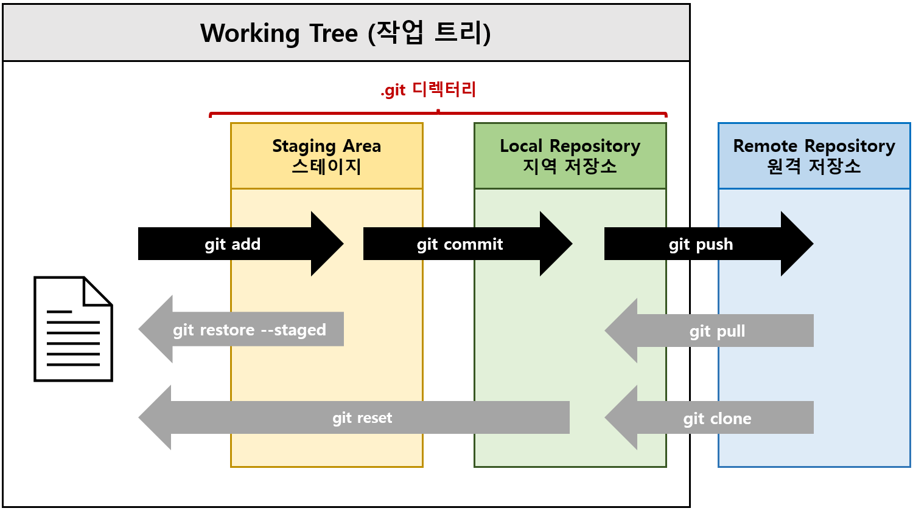

# Git-Study
**Subject**

- **Git & GitHub** 스터디 | 2023.06 **HIPS** 스터디 | 2023.09~10 **HUST** 스터디

**Contributor**

- [mingimouse](https://github.com/mingimouse) (홍민기)

---

## Table of Contents

### I. Git 이란?

- [Git 소개 및 설치](./git01.md)
- [Linux 기본 명령1: 디렉터리 관리](./git02.md)
- [Linux 기본 명령2: Vim 편집기](./git03.md)

### II. Git 버전관리

- [버전 생성하기](./git04.md)
- [버전 확인하기](./git05.md)
- [버전 되돌리기](./git06.md)
- [버전 제외하기(.gitignore)](./git07.md)

### III. Git 브랜치

- [Git에서 브랜치 관리하기](./git08.md)
- [cherry-pick 병합](./git09.md) (업로드 아직 안함)

### IV. GitHub 백업, 협업

- [GitHub 백업하기](./git10.md)
- [GitHub 협업하기](./git11.md) (업로드 아직 안함)
