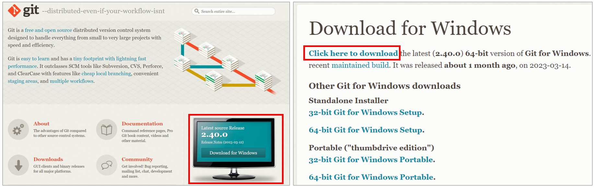
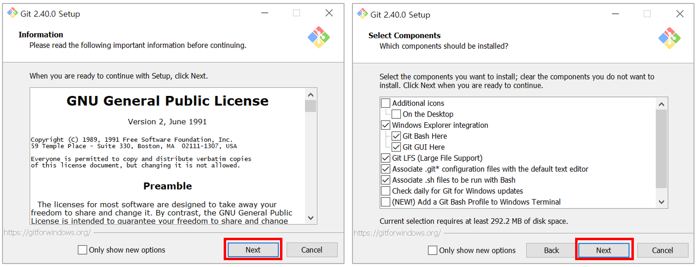
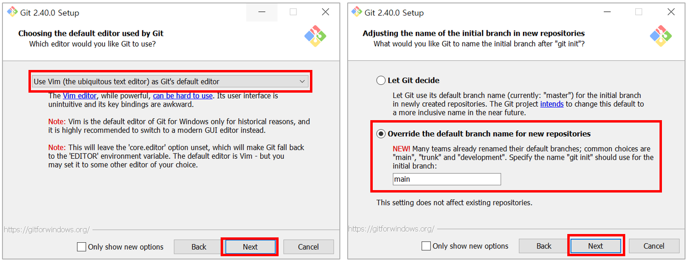
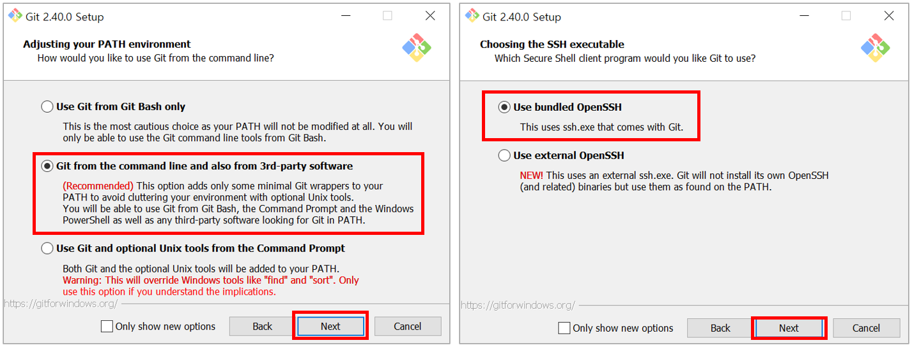
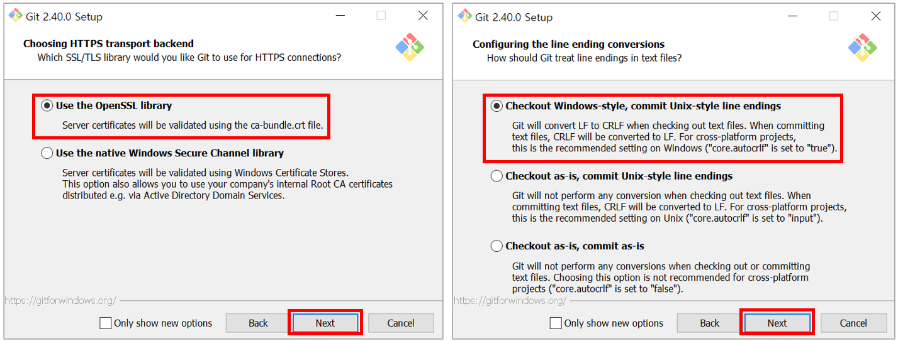
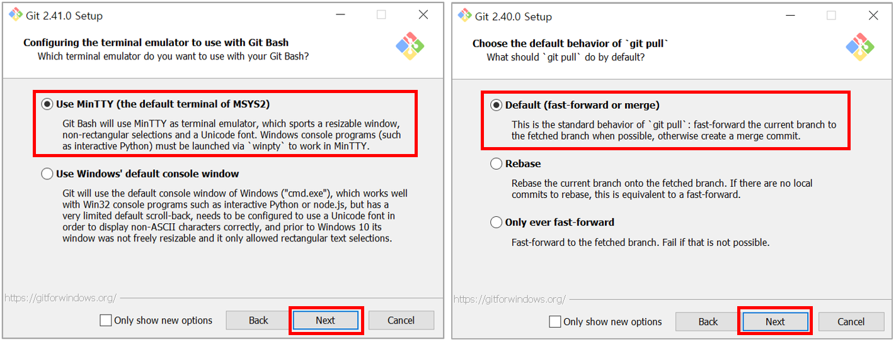
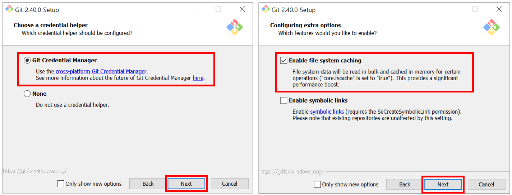
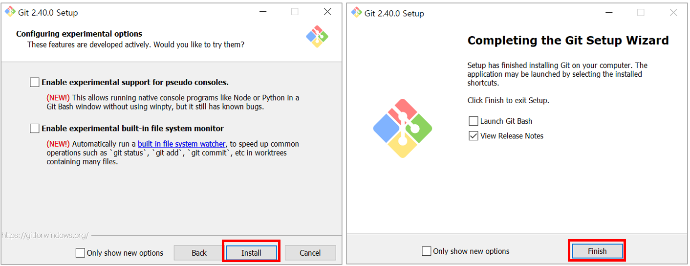
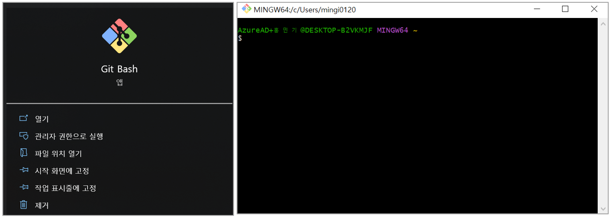

# Git 소개 및 설치

## 01. Git 소개

`Git`은 **Linus Torvalds**가 개발한 버전 관리 시스템(Version Control System)이다. 

Git을 통해 소스 코드들을 효과적으로 관리할 수 있다. 

1. `버전 관리(Version Control)`: 문서를 수정할 때마다 언제, 무엇을 변경했는지 자세히 기록한다. 

2. `백업(Backup)`: 온라인 저장소인 GitHub를 통해, 파일들을 백업할 수 있다. 

3. `협업(Collaboration)`: 온라인 저장소인 GitHub를 통해, 편리하게 협업을 할 수 있다. 

---

## 02. Git 설치 (Windows)

[https://git-scm.com/](https://git-scm.com/)에 접속해, 운영체제에 맞게 프로그램을 다운로드 한다. 

 

라이센스 정보와, 구성요소를 확인한다. 

 

기본 편집기로 Vim을 선택하고, 브랜치 이름을 main으로 설정한다. 

 

커맨드 라인에서 Git을 사용할 방법과, 보안 서버에 접속하는 방법을 설정한다. 

 

보안이 추가된 연결에 연결할 방법과, 텍스트 파일에서 줄 끝부분을 처리하는 방법을 설정한다. 

 

터미널 애뮬레이터와 'git pull' 명령을 처리하는 방법을 설정한다. 

 

Git 자격 증명 관리자를 선택하고, 파일 시스템을 캐싱하도록 설정한다. 

 

제시된 옵션 사용 여부를 선택 후, [Install]을 눌러 설치를 완료한다. 

 

설치 후, 윈도우 탐색기에서 [Git Bash]가 정상적으로 실행되면 설치에 성공한 것이다. 

---