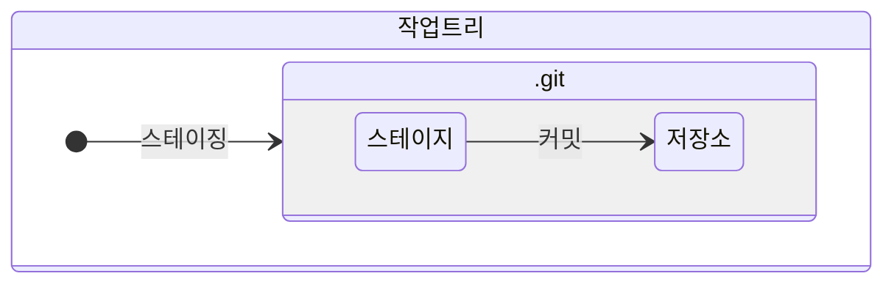

# 버전 생성하기

## 01. 버전 관리

`버전(version)`: 프로그램에 수정 내용이 생기면, 이전 상태와 구별하는 것<br>

일반적으로 `git 2.40.1` 같이 프로그램 뒤에 숫자를 붙여 버전을 구별한다.<br>

<br>

**Git을 통한 버전 관리 장점**

- 숫자를 붙이지 않고, 파일 이름을 그대로 유지하면서 버전 관리를 할 수 있다.<br>

- 버전에 대한 구체적인 정보를(시간, 작성자, 내용) 변경 시점마다 저장할 수 있다.<br>

- 버전마다 작업 내용을 확인할 수 있고, 이전 버전으로 되돌릴 수 있다.<br>

---

## 02. 버전 생성 이론



### I. 주요 개념

- `작업 트리(working tree)`: 파일 수정, 저장 등의 작업을 하는 디렉터리<br>

- `스테이지(stage area)`: 버전으로 만들 파일이 대기하는 곳<br>

- `저장소(repository)`: 스테이지에서 대기하고 있던 파일들을 버전으로 만들어 저장하는 곳<br>

작업 트리는 **눈에 직접 보이는** 디렉터리다.<br>

스테이지와 저장소는 숨김 파일인 `.git` 디렉터리 안에 있기 때문에 **눈에 보이지 않는다**.<br>

<br>

### II. 버전 생성 과정

1. Git 저장소로 사용할 디렉터리를 생성하고, 초기화한다.<br>

2. 작업 트리에서 파일을 작성하고 저장한다.<br>

3. `스테이징(staging)`: 작업 트리에서 수정한 파일을 스테이지로 옮기는 과정<br>

4. `커밋(commit)`: 스테이지에서 대기하고 있던 파일을 저장소로 이동시켜 버전을 생성하는 과정<br>

---

## 03. git init

```bash
git init
```

`git init`: 현재 디렉터리에서 Git을 사용할 수 있도록 `초기화`하는 명령<br>

명령을 실행하면 **.git** 디렉터리가 생성된다.<br>

**.git** 디렉터리 안에는 스테이지와 저장소가 있다.<br>

**.git** 디렉터리는 사용자가 실수로 지우지 않도록 **숨김 파일** 처리가 되어있다.<br>

<br>

```bash
git init 디렉터리명
```

`git init` 명령 뒤에 디렉터리명을 붙이면, 해당 디렉터리의 `생성`과 `초기화`를 동시에 한다.<br>

---

## 04. git add

```bash
git add 파일명
git add 파일명1 파일명2	# 여러 개인 경우
```

`git add`: 스테이징을 실행하는 명령 (작업트리 :arrow_right: 스테이지)<br>

**LF will be replaced by CRLF** 경고가 나타날 수도 있는데 넘어가도 된다.<br>

스테이지에 있는 파일들은 `.git/index`에 저장된다.<br>

<br>

```bash
git add .
git add *
```

여러 개의 파일들을 한 번에 스테이징 하고 싶으면 `git add .`나 `git add *`를 입력하면 된다.<br>

- `git add .`: **.gitignore**파일에 있는 파일들은 제외하고, 스테이지에 올리는 것<br>

- `git add *`: **.gitignore**파일에 있는 파일들도 스테이지에 올리는 것<br>

---

## 05. git commit

```bash
git commit -m "커밋 메시지"
```

`git commit`: 커밋을 실행해 버전을 생성하는 명령 (스테이지 :arrow_right: 저장소)<br>

`-m`: 'git commit'명령에 커밋 메시지를 추가하는 옵션<br>

커밋 메시지는 버전의 변경 사항에 대한 정보를 간단히 작성한다.<br>

<br>

```bash
git commit -am "커밋 메시지"
```

`-am`: 스테이징과 커밋을 동시에 처리하는 옵션<br>

이 옵션은 이전에 한 번이라도 커밋한 적이 있는 파일을 다시 커밋할 때만 사용할 수 있다.<br>

<br>

```bash
git commit --amend
```

`--amend`:  직전에 작성한 커밋 메시지를 수정할 수 있는 옵션<br>

명령을 실행하면 Vim이 실행되는데, 여기서 커밋 메시지를 수정, 저장, 종료해주면 된다.<br>

---

