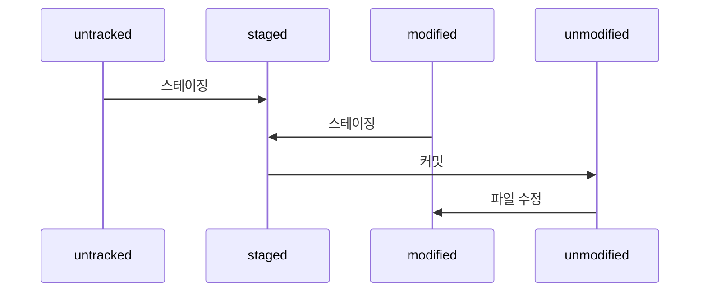

# 버전 확인하기

## 01. git status

```bash
git status
```

`git status`: 현재 Git의 상태를 출력해주는 명령<br>

Git을 사용하면서, git status 명령의 출력 메시지를 해석해 현재 상태를 파악하는 것이 중요하다.<br>

<br>



git status 명령을 해석하기 위해 알아야 하는 **파일의 상태**는 다음과 같다.<br>

- `untracked`: 한 번도 커밋하지 않아, Git이 수정 내역을 추적하지 않는 파일<br>

- `tracked`: 파일을 한 번 이상 커밋해, Git이 수정 내역을 추적하는 파일<br>

  - `unmodified`: 커밋을 완료한 온전한 상태의 파일<br>

  - `modified`: 작업 트리에서 수정한 파일<br>

  - `staged`: 스테이지에 있는, 커밋 직전의 파일<br>

---

## 02. git log

```bash
git log
```

`git log`: 커밋에 대한 정보를 확인할 때 사용하는 명령<br>

`커밋 로그(commit log)`: git log 명령을 실행했을 때 함께 출력되는 정보들의 집합<br>

- `커밋 해시(commit hash)`: 커밋을 구성하는 아이디 역할(영문자와 숫자의 조합)<br>

- `(HEAD -> main)`: 이 커밋이 가장 최신 커밋이라는 표시<br>

- 커밋의 작성자, 작성 시간, 커밋 메시지

<br>

```bash
git log --oneline
git log --oneline -n5	# 최신 5개의 커밋만 간단하게 출력
```

`--oneline`: 간단한 커밋 해시와 제목만 나타내는 옵션<br>

`-nx`: 최신 x개의 커밋만 나타내는 옵션<br>

<br>

```bash
git log --stat
```

`--stat`: 커밋과 관련된 파일이 무엇인지 나타내는 옵션<br>

---

## 03. git diff

```bash
git diff
```

`git diff`: 최근 커밋과 작업 트리의 수정 파일을 비교하는 명령 (unmodified :vs: modified)<br>

git diff 명령으로 수정한 파일을 커밋하기 전에 최종적으로 검토할 수 있다.<br>

<br>

```bash
git diff --staged
```

`--staged`: 최근 커밋과 스테이징된 파일을 비교하는 옵션 (unmodified :vs: staged)<br>

<br>

```bash
git diff 커밋해시1 커밋해시2
```

git diff 명령 뒤에 커밋해시 2개를 붙이면, 각 커밋을 비교한다. (unmodified :vs: unmodified)<br>

---