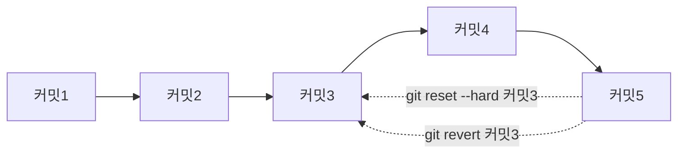

# 버전 되돌리기

## 01. 수정한 파일 되돌리기


```bash
git restore 파일명
```

`git restore 파일명`: 작업 트리에서 수정한 파일을 수정 이전의 상태로 되돌리는 명령<br>

---

## 02. 스테이징 되돌리기


```bash
git restore --staged 파일명
```

`git restore --staged 파일명`: 스테이징을 되돌리는 명령<br>

---

## 03. 최신 커밋 되돌리기


```bash
# 최신 1개 커밋 되돌리기
git reset HEAD^
git reset HEAD~1

# 최신 2개 커밋 되돌리기
git reset HEAD^^
git reset HEAD~2
```

`git reset HEAD^`: 가장 최근의 커밋을 삭제하는 명령<br>

- `^`의 개수에 따라 되돌릴 커밋의 수가 결정된다.<br>

- `~숫자`로도 되롤릴 커밋의 수를 입력할 수 있다.<br>

<br>

git reset 명령은 옵션에 따라 되돌릴 수 있는 단계가 다르다 (기본 옵션 = **mixed**)<br>

- `git reset --soft HEAD^`: 커밋을 취소하고, 파일을 **staged** 상태로 보관한다.<br>

- `git reset --mixed HEAD^`: 커밋을 취소하고, 파일을 **unstaged** 상태로 보관한다.<br>

- `git reset --hard HEAD^`: 커밋을 취소하고, 작업 트리에서도 삭제한다.<br>

---

## 04. 특정 커밋으로 되돌리기



### I. git reset --hard (이후 커밋 삭제)

```bash
git reset --hard 복사한 커밋 해시
```

`git reset --hard 복사한 커밋해시`: 복사한 커밋으로 되돌아가는 명령<br>

명령을 실행하면 특정 커밋으로 되돌아 가고, 그 이후의 커밋은 삭제된다.<br>

<br>

### II. git revert (이후 커밋 보관)

```bash
git revert 복사한 커밋 해시
```

`git revert 복사한 커밋해시`: 변경 사항만 취소하고, 커밋은 남겨둘 때 사용하는 명령<br>

명령을 실행하면 Vim 편집기가 자동으로 열리는데, 커밋 메시지를 남겨주면 된다.<br>

명령을 실행하면 파일의 내용은 특정 커밋으로 변경되지만, 커밋 기록은 이전과 동일하다.<br>

---


