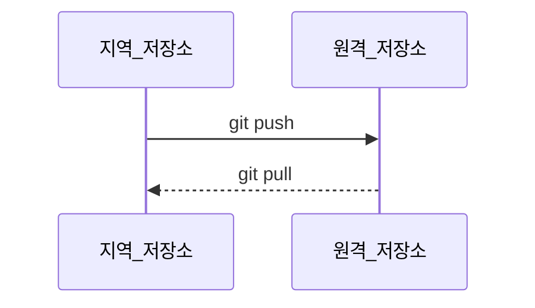

# GitHub 백업하기

## 01. 지역 저장소 & 원격 저장소



`지역 저장소(local repository)`: 사용자 컴퓨터에 저장되는 저장소<br>

`원격 저장소(remote repository)`: 전용 서버에 저장되는 온라인 저장소<br>

우리가 개인 컴퓨터에 터미널을 통해 만든 저장소가 지역 저장소다.<br>

원격 저장소는 지역 저장소와 연결되어 있으며, `백업`과 `협업`이라는 중요한 역할을 한다.<br>

<br>

`push`: 지역 저장소에서 원격 저장소로 커밋을 등록하는 것<br>

`pull`: 원격 저장소의 변경 사항을 지역 저장소로 내려받는 것<br>

`동기화(synchronize)`: 지역 저장소와 원격 저장소의 상태를 항상 같게 유지하는 것<br>

---

## 02. GitHub


`GitHub`: 인터넷에서 사용할 수 있는 버전 관리 서비스<br>

Git으로 관리하는 프로젝트들을 저장할 수 있는 원격 저장소<br>

<br>

**GitHub를 통해 할 수 있는 작업들**

1. 원격 저장소에서 Git을 사용할 수 있다.<br>

2. 지역 저장소를 백업할 수 있다.<br>

3. 협업 프로젝트와 오픈 소스 프로젝트에 편리하다.<br>

4. 자신의 개발 이력을 남길 수 있다.<br>

---

## 03. git remote

```bash
git remote add origin 복사한 원격 저장소 주소
```

`git remote add origin`: 지역 저장소와 원격 저장소를 연결하는 명령<br>

원격 저장소(`remote`)에 GitHub 저장소 주소(`origin`)을 추가(`add`)하겠다는 뜻이다.<br>

<br>

```bash
git remote -v
```

`git remote -v`: 지역 저장소와 원격 저장소가 연결이 잘 되었는지 확인하는 명령<br>

지역 저장소와 원격 저장소를 연결하는 작업은 한 번만 하면 된다.<br>

<br>

```bash
git remote remove origin
```

`git remote remove origin`: 지역 저장소와 원격 저장소간의 연결의 제거하는 명령<br>

---

## 04. git push

```bash
git push -u origin main
git push
```

`git push`: 지역 저장소에서 원격 저장소로 커밋을 push할 때 사용하는 명령<br>

처음 push 할때는 `-u` 옵션을 사용해야 한다 (지역 저장소의 브랜치를 원격 저장소의 브랜치로 연결)<br>

지역 저장소의 브랜치를 원격 저장소(`origin`)의 `main` 브랜치로 `push`한다는 뜻이다.<br>

이 명령은 처음에 한 번만 사용하면 된다. (이후에는 `git push`만 사용해도 된다)

---

## 05. git pull

```bash
git pull origin main
git pull
```

`git pull`: 원격 저장소에서 지역 저장소로 커밋을 pull할 때 사용하는 명령<br>

**'git pull'** 뒤에는 원격 저장소 이름(`origin`)과 지역 저장소의 브랜치 이름(`main`)을 적는다.<br>

기본 설정인 경우(origin/main) `git pull`이라고 사용해도 된다.<br>

`git pull` = `git fetch` + `git merge`<br>

---

## 06. git clone

```bash
git clone 원격 저장소 주소
```

`git clone`: 원격 저장소의 저장소를 내 지역 저장소에서 이용할 수 있게, 그대로 복사해 가져온다.<br>

- **git clone** :arrow_right: 지역 저장소의 내용이 원격 저장소의 내용과 일치해진다. (기존 작업 삭제 가능성 O)<br>

- **git pull** :arrow_right: 원격 저장소의 내용을 지역 저장소로 가져와 병합(merge)하는 것이다.<br>

---

## 07. git fetch

```bash
git fetch	# fetch
git diff HEAD origin/main	# local의 최신커밋과 remote에서 가져온 커밋 비교
git merge origin/main	# 병합
```

`git fetch`: 원격 저장소의 내용을 가져와 지역 저장소와 동기화는 하지만, 병합(merge)은 하지 않는 명령<br>

<br>

**git fetch**의 사용법은 다음과 같다.<br>

1. `git fetch` 명령을 통해 fetch를 진행한다.<br>

2. `git diff HEAD origin/main` 명령을 통해 local의 최신 커밋과 remote에서 가져온 커밋을 비교한다.<br>

3. 문제가 없다면 `git merge origin/main` 이나 `git pull`명령을 통해 병합한다.<br>

---


