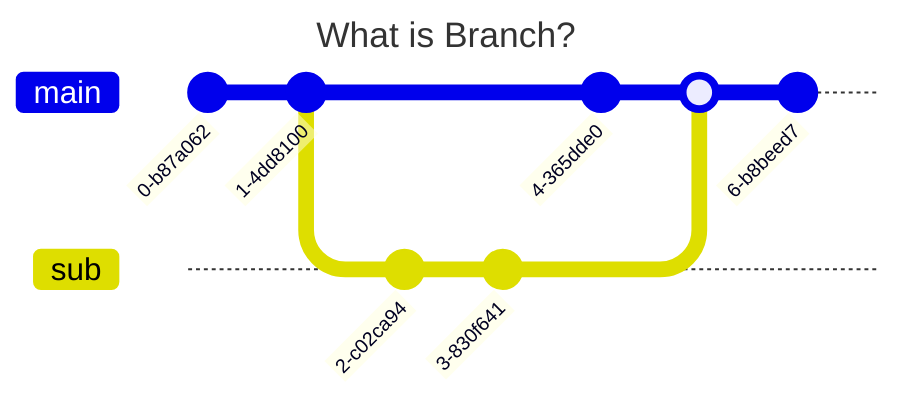

# 브랜치 관리하기

## 01. 브랜치



`브랜치(branch)`: 기존 작업에서 독립적인 작업을 진행하기 위한 개념<br>

브랜치를 사용해 작업을 관리하면 제대로 동작하는 작업은 그대로 두고, 추가적인 버전을 만들어 따로 관리하고, 원래 버전과 합칠 수 있다.<br>

<br>

Git은 기본 브랜치로 `main`을 사용한다 (예전 버전의 경우: `master`)<br>

사용자가 커밋할 때마다 브랜치는 어떤게 최신 커밋인지에 대한 정보를 갖는다.<br>

즉, 브랜치는 **커밋을 가리키는 포인터**와 비슷하다고 생각하면 편하다.<br>

<br>

- `분기(branch)`: 기본 main 브랜치에서 새 브랜치를 만드는 것<br>

- `병합(merge)`: 새 브랜치에 있던 작업을 원래 main 브랜치로 합치는 것<br>

---

## 02. git branch

### i. 브랜치 확인

```bash
git branch
```

`git branch`: 현재 존재하는 브랜치를 확인할 때 사용하는 명령<br>

<br>

### ii. 브랜치 생성

```bash
git branch 브랜치명
```

`git branch 브랜치명`: 해당 브랜치를 생성하며, 분기한다.<br>

<br>

### iii. 브랜치 삭제

```bash
git branch -d 브랜치명
git branch -D 브랜치명
```

`git branch -d 브랜치명`: 브랜치를 삭제하는 명령<br>

현재 브랜치에 병합되지 않은 브랜치를 삭제하려면, `-D` 옵션을 사용해 강제 삭제한다.<br>

---

## 03. git switch

```bash
git switch 브랜치명
```

`git switch 브랜치명`: 해당 브랜치로 전환해주는 명령<br>

---

## 04. 브랜치와 커밋의 관계 

```bash
git log --oneline --branches --graph
```

`git log`에는 다양한 옵션들이 있다.<br>

- `--oneline`: 커밋 정보를 한 줄로 간단하게 나타내는 옵션<br>

- `--branches`: 브랜치마다 최신 커밋을 확인하는 옵션<br>

- `--graph`: 브랜치와 커밋의 관계를 쉽게 파악하도록 그래프로 표현해주는 옵션<br>

---

## 05. 브랜치 사이의 차이점

```bash
git log 브랜치a..브랜치b
```

`git log 브랜치a..브랜치b`: 두 브랜치 사이의 차이를 확인하는 명령<br>

브랜치a에는 없고, 브랜치b에는 있는 커밋을 출력한다.<br>

---

## 06. git merge

```bash
git merge 브랜치명
```

`git merge 브랜치명`: 분기한 브랜치를 합칠 때 사용하는 명령<br>

브랜치A에서 **'git merge B'**를 실행하면, A브랜치에 B브랜치를 병합한다.<br>

<br>

### 병합의 상황

1. **서로 다른 파일을 수정하고 병합** :arrow_right: 문제 없이 병합된다.<br>

2. **동시에 한 문서의 다른 부분을 각각 수정하고 병합** :arrow_right: 문제 없이 병합된다.<br>

3. **동시에 한 문서의 같은 부분을 각각 수정하고 병합** :arrow_right: 충돌(CONFLICT) 발생 :arrow_right: vim으로 직접 수정 후 커밋<br>

---